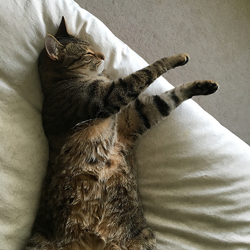
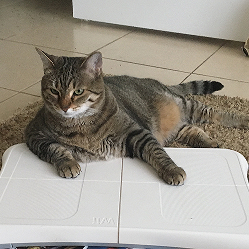

<!DOCTYPE html>
<html>

<head>
	<meta charset="utf-8">
	<!---<title>Cats</title> --->
<!--- -->
</head>

<body>
<h1>Cats</h1>

Cats are the spirit animal of the <a href="https://www.w3.org">Internet.</a>

<h4><strong>Famous Cats</strong></h4>
<ul>
<li>Felix</li>
<li>Garfield</li>
<li>Grumpy Cat</li>
</ul>

<h4>Cool House Cats</h4>

<h4><em>Flynn: Happy kitty, sleepy kitty.</em></h4>

<h4><em>Quorra: Mii-ow Fit.</em></h4>

<h4>Cat Shopping List</h4>

<table>
<tr>
	<th><strong>Item</strong></th>
	<th><strong>Price</strong></th>
</tr>
<tr>
	<td>Raw Tuna</td>
	<td>$5</td>
</tr>
<tr>
	<td>Catnip (Organic)</td>
	<td>$3</td>
</tr>
</table>
</body> 
